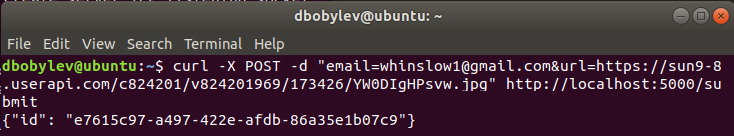
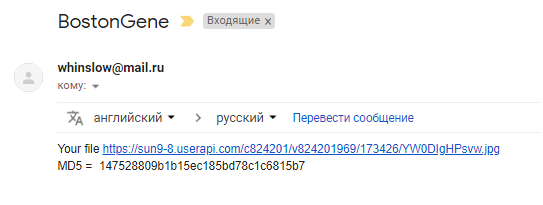
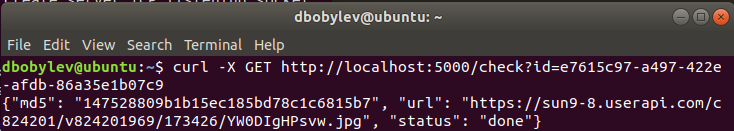
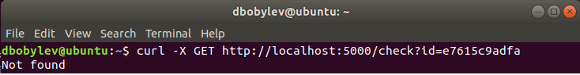
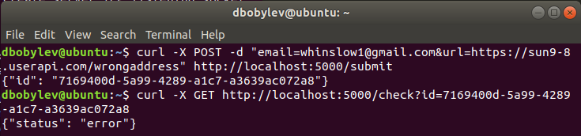
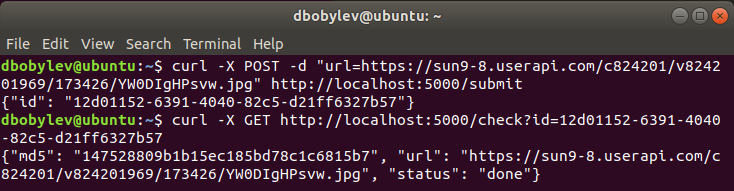

# Задание

Необходимо написать небольшой веб-сервис, позволяющий
посчитать MD5-хеш от файла, расположенного в сети Интернет.
Скачивание и расчет должны происходить в фоновом режиме. API
данного сервиса следующий:

• POST запрос на /submit с параметрами url и email. На этот
запрос сервис должен создать задачу с идентификатором, по
которому пользователь может узнать о состоянии ее выполнения.
Email — опциональный параметр. Если он указан, то по окончанию
выполнения задачи, необходимо прислать на этот адрес письмо в
котором будет указан url файла и его посчитанная MD5-хеш
сумма. В качестве ответа на этот запрос необходимо выдать
пользователю идентификатор задачи.

• GET запрос на /check с параметром id. На этот запрос сервис
должен вернуть пользователю состояние задачи по указанному
им id. Состояния — задачи не существует, задача в работе, задача
завершена, задача завершилась неудачей. Если задача
завершена, то помимо этого необходимо указать в ответе url
документа и его посчитанную MD5-хеш сумму. Статус код ответа
должен согласоваться с самим ответом (404, если задачи не
существует и тд)

Пример использования данного сервиса:
```
>>> curl -X POST -d
"email=user@example.com&url=http://site.com/file.txt"
http://localhost:8000/submit
{"id":"0e4fac17-f367-4807-8c28-8a059a2f82ac"}
```
```
>>> curl -X GET http://localhost:8000/check?id=0e4fac17-f367-
4807-8c28-8a059a2f82ac
{"status":"running"}
```
```
>>> curl -X GET http://localhost:8000/check?id=0e4fac17-f367-
4807-8c28-8a059a2f82ac
{"md5":"f4afe93ad799484b1d512cc20e93efd1","status":"done","url":"
http://site.com/file.txt"}
```


# Решение

Необходимо сразу заметить ключевые моменты, с которыми нам придется столкнуться в рамках реализации.
1) веб-сервер
2) скачивание файла
3) Рассчет md5 суммы файлы
4) Отправка email
5) Выполнение обработки запросов ассинхронно: т.е необходимо параллельно обрабатывать файлы и отправку писем

После того, как мы выявили ключевые подзадачи, необходимо определиться с технологиями, котороые мы будем применять:

* Для веб-сервера был выбран фраемворк Flask, т.к. с ним мне уже приходилось работать и он мне кажется вполне удобным.

* Скачивание файла будем осуществлять в заранее созданную папку Downloads, используя библиотеку urllib

* Отправка почты будет производиться с SMTP сервера, конкретно с smtp.mail.ru (Он самый простой в настройке, gmail блокирует сторонние "небезопасные" приложения, поэтому нужно отдельно еще и разрешать доступ. В данном случае нам не принципиально и мы будем использвать smtp.mail.ru). В качестве библиотеки используем smtplib.

* Наиболее важная подзадача - параллеьная обработка пользовательских файлов и рассылка на почту. Подходящим вариантом, на мой взгляд, является использование очереди задач: Python-RQ. Архитектуру проще всего проиллюстрировать следующим образом:

. 


Главным аналогом является Celery - наиболее продвинутый инструмент работы с очередями задач. Но необходимости использовать его в данной задачи нет.

* Считать md5 сумму будем, используя библиотеку hashlib. Сложности посчитать md5 файла нет


# Листинг кода
[requirements.txt](requirements.txt)

[main.py](BostonGeneTest/main.py)

[downloader.py](BostonGeneTest/downloader.py)

# Инструкция по запуску
1) скачать BostonGeneTest проект:
   - должна быть папка BostonGeneTest, в которой расположена пустая папка Downloads, downloader.py, main.py
2) перейти в папку BostonGeneTest и установить Redis:
 ```
wget http://download.redis.io/redis-stable.tar.gz
tar xvzf redis-stable.tar.gz
cd redis-stable
make
sudo make install
```
Note: должны быть установлены необходимые зависимости, в частности, flask

3) настроить почту в downloader.py
```
def sendMassage(fileUrl, md5, toEmail):
    fromEmail = "youremail@mail" #set your email
    
    textMessage = '''Your file ''' + fileUrl + '''\nMD5 =  ''' + str(md5)
    msg = MIMEText(textMessage, 'plain')
    msg['Subject'] = "BostonGene"
    
    try:
        server = SMTP('smtp.mail.ru') # set smptp server
        server.login("youremail@mail", "yourpassword") #set login and password
        server.sendmail(fromEmail, toEmail, msg.as_string())
        server.quit()
        return True
    except smtplib.SMTPException as e:
        return False
```
3) Запустить процессы:
```
Запуск Redis: redis-server - команда в отдельном окне терминала
Запуск worker: rq worker - команда в отдельном окне терминал (процесс лучше запускать из той директории, в которой будут запускаться вычислительные функции downloader.py, у нас это директория - BostonGeneTest)
Запуск веб-сервера: python3 main.py - команда в отдельном окне терминала из директории где находится наш веб-сервер
```

# Тестирование

1) POST запрос с почтой и файлом


2) GET запрос по существующему айди

3) GET запрос по не существующему айди

4) Некорректная ссылка на файл

5) POST запрос только с файлом



